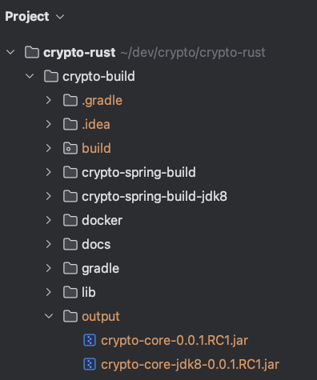

# crypto-rust

<!-- TOC -->
* [crypto-rust](#crypto-rust)
  * [🚦 성능 테스트 결과](#-성능-테스트-결과)
  * [🚦 Crypto 암호화 솔루션 핵심 알고리즘 구조](#-crypto-암호화-솔루션-핵심-알고리즘-구조)
  * [🚦 Specification](#-specification)
    * [► 프로젝트에서 사용되는 암호화 알고리즘](#-프로젝트에서-사용되는-암호화-알고리즘)
    * [► 지원되는 MultiPlatform](#-지원되는-multiplatform)
    * [► Rust 프로젝트 구성](#-rust-프로젝트-구성)
  * [🚦 Gradle Build Command](#-gradle-build-command)
    * [► `crypto-core` Library 빌드](#-crypto-core-library-빌드)
    * [► 지원되는 파라메터](#-지원되는-파라메터)
<!-- TOC -->

DB 암호화 솔루션 외부 공개용 프로젝트 입니다  
외부 공개용 프로젝트에서는 AWS KMS 를 사용하지 않고 LOCAL 에서만 암호화/복호화를 수행합니다

본 프로젝트는 Rust 로 개발된 LOCAL 암호화 라이브러리를 JNI 로 빌드할 수 있도록 구성되었습니다

Cross Compile 을 위해 `cross` 를 사용해 컴파일하며 `podman` 을 사용하여 Docker 환경을 구성하고 `flapigen` 을 사용하여 Rust FFI 를 생성합니다

위의 과정을 Gradle Task 로 구성하여 쉽고 빠르게 빌드할 수 있도록 구성되었습니다

이 암호화 솔루션은 의존성을 최소화하여 순수 Java JNI 라이브러리 구성으로 Java Application 에서 쉽고 빠르게 적용하고 사용할 수 있도록 구성되었으며   
강력하고 안전하게 암호화를 수행합니다

또한 성능도 뛰어나서 Application 에서 암호화/복호화를 수행할 때 성능 저하가 거의 없습니다

아래의 성능 테스트 결과를 참고하시기 바랍니다

## 🚦 성능 테스트 결과

---

아래의 성능 테스트 결과를 보면 암호화/복호화를 수행할 때 성능 저하가 거의 없음을 확인할 수 있습니다

- 성능 테스트 조건
  - 암호화 테스트 (100 RPS, 100 건 Bulk Insert)
  - 복호화 테스트 (100 RPS, 1000 ROW Select)

| 등록시 암호화 미적용      | 조회시 복호화 미적용       |
|:-----------------|:------------------|
| 99.5 / 100 RPS   | 93.9 / 100 RPS    |
| 최소 14ms, 평균 23ms | 최소 60ms, 평균 120ms |

| 등록시 암호화 적용       | 조회시 복호화 적용       |
|:-----------------|:-----------------|
| 99.9 / 100 RPS   | 95.3 / 100 RPS   |
| 최소 17ms, 평균 27ms | 최소 44ms, 평균 79ms |


## 🚦 Crypto 암호화 솔루션 핵심 알고리즘 구조

---

- [Encryption Algorithm](docs/EncryptionAlgorithm.md)


## 🚦 Specification

---

- [Rust 1.83.0](https://www.rust-lang.org/)
- [Gradle 8.12.1](https://gradle.org/)
- Java 9+
- [Podman 5.3.2](https://podman.io/)
- [flapigen 0.8.0](https://github.com/Dushistov/flapigen-rs)
- [cross 0.2.5](https://github.com/cross-rs/cross)

### ► 프로젝트에서 사용되는 암호화 알고리즘

- AES256-GCM
- AES256-CBC
- SHA256
- MD5

### ► 지원되는 MultiPlatform

- **Windows**
    - x86_64(AMD64)
- **Linux**
    - x86_64(AMD64)
    - AARCH64(ARM64)
- **MacOS**
    - Apple Silicon(ARM64)

### ► Rust 프로젝트 구성

- `crypto-build`
    - Cross Compile MultiPlatform JNI Build Module
    - `crypto-spring-build`
      - Spring Boot Build Test Module
    - `crypto-spring-build-jdk1.8`
      - Spring Boot JDK8 Build Test Module
- `crypto-lib`
    - Rust Library Core
- `flapigen`
    - Rust FFI Generator

## 🚦 Gradle Build Command

---

### ► `crypto-core` Library 빌드

crypto-build 프로젝트 경로로 이동

```shell
$ cd crypto-build
```

기본 빌드 및 jar 파일 생성
- output 경로 `crypto-build/output/crypto-core-0.0.1.RC1.jar`

```shell
$ ./gradlew :lib:clean :lib:build
```

### ► 지원되는 파라메터

- `javaVersion`: java 버전이 8인지 아닌지를 구분하기 위한 파라메터
  - 8을 입력하면 JDK8 이상에서 사용가능한 라이브러리가 생성된다
    - output: `crypto-core-jdk8-0.0.1.RC1.jar`
  - 입력하지 않으면 기본값 11 적용되고 JDK11 이상에서 사용가능한 라이브러리가 생성된다
    - output: `crypto-core-0.0.1.RC1.jar`
- `version`: crypto 라이브러리 버전
  - 입력값대로 버전을 지정한다
  - 입력하지 않으면 기본 버전이 적용된다


Gradle Build Command 파라메터 입력 예:

```shell
# javaVersion 은 JDK8 라이브러리 버전은 0.0.1.RC1로 지정
$ ./gradlew :lib:clean :lib:build -PjavaVersion=8 -Pversion=0.0.1.RC1

# javaVersion 은 JDK8 라이브러리 버전은 기본 버전 지정
$ ./gradlew :lib:clean :lib:build -PjavaVersion=8

# javaVersion 은 기본값인 JDK11 라이브러리 버전은 0.0.1.RC1로 지정
$ ./gradlew :lib:clean :lib:build -Pversion=0.0.1.RC1

# javaVersion 은 기본값인 JDK11 라이브러리 버전은 기본 버전 지정
$ ./gradlew :lib:clean :lib:build
```

output 경로:

